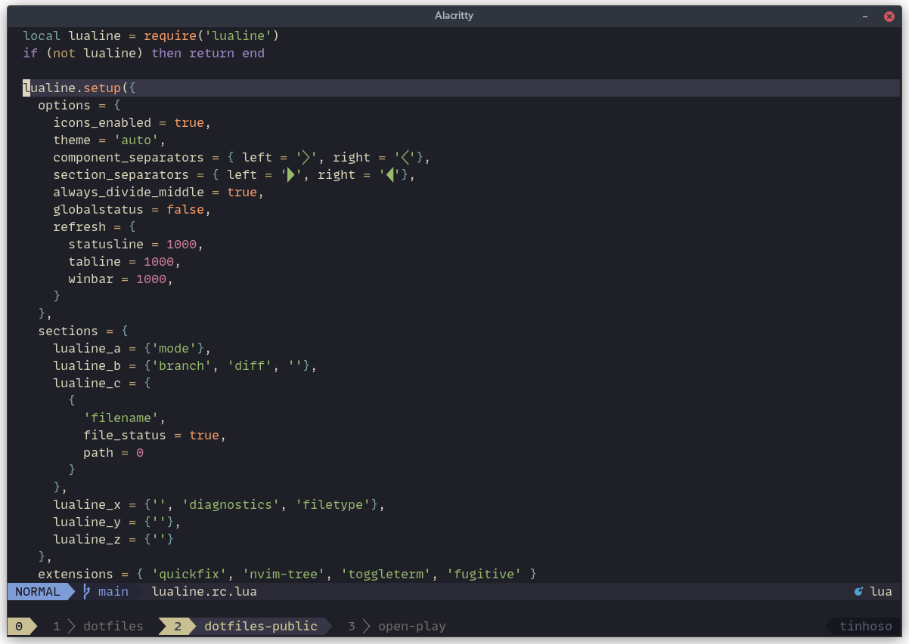

# Forever WIP dotfiles




## Setting up TMUX

```
ln -sf $(pwd)/tmux.conf ~/.tmux.conf
```

## Setting up ZSH

## Setting up Bash

## Setting up Git

## Setup Neovim

```
cd ~/dotfiles-public/.config/nvim
lndir $(pwd) ~/.config/nvim
```
